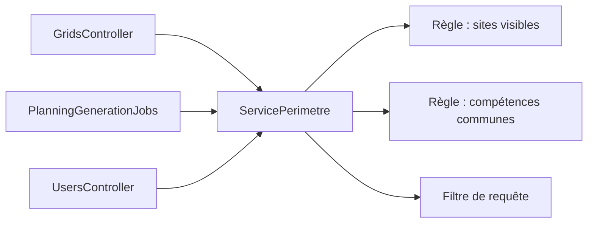

# Droits par rôle : inventaire (étapes 1 et 2) et suite

## Rappel du fonctionnement actuel

- Rôles en base : 1 = Administrateur, 2 = Manager, 3 = Utilisateur. Le formulaire [templates/Roles/add.php](templates/Roles/add.php) parle d'« Agent », qui n'est pas le nom en base.
- [src/Application.php](src/Application.php) : `requireAuthorizationCheck => true`, avec un `MapResolver` qui associe chaque classe `*Resource` à une `*Policy`.
- [src/Controller/AppController.php](src/Controller/AppController.php) (lignes 80 à 99) appelle `authorize($request, 'access')`, et [src/Policy/RequestPolicy.php](src/Policy/RequestPolicy.php) répond toujours oui. **Toute action qui n'appelle pas elle-même `authorize()` sur une Resource est donc ouverte à n'importe quel utilisateur connecté, y compris le rôle 3.**

## Étape 1 : actions sans vraie vérification (failles)

- `WfmSettingsController` : tout le CRUD (`index`, `view`, `add`, `edit`, `delete`). Il n'y a ni policy ni Resource, et le contrôleur est absent du `MapResolver`. La tuile n'est affichée qu'aux admins, mais l'URL est ouverte à tous.
- `ForecastScenariosController::edit` (ligne 308) : aucun `authorize()`, alors que `canEdit` existe dans la policy et n'est jamais utilisé. Un agent peut modifier un scénario.
- `PagesController::display` : `/pages/admin` est accessible à tous. `PagesPolicy::canAdmin` existe mais n'est jamais appelé.
- `GridsController::index` et `getUsersBySite` : aucun `authorize()`. Un agent voit toute la grille de tous les sites, et `getUsersBySite` sans `site_id` renvoie tous les utilisateurs. C'est peut-être voulu pour `index`, mais ce n'est pas décidé explicitement.
- `UsersController::edit` et `add` : `UsersPolicy` autorise les rôles 1 et 2, `role_id` est modifiable en masse ([src/Model/Entity/User.php](src/Model/Entity/User.php), ligne 38), et `patchEntity` n'a pas de liste blanche (lignes 323 et 771). **Un manager peut donc promouvoir n'importe qui administrateur, lui compris, et modifier un compte admin.**
- `Users::account` et `changePassword` : pas d'`authorize()`, mais limités à l'utilisateur connecté. C'est acceptable.

## Étape 1 : incohérences de règles

- `PlanningGenerationJobs::retry` est autorisé via `delete` (ligne 174), et `clearDraft` via `publish` (ligne 2016).
- `RangesPolicy` est réservée à l'admin, alors que `Grids::add`, qui enregistre des plages depuis la grille, est autorisé aux rôles 1 et 2. La même donnée a deux règles différentes.
- `RemoteWorkPolicy` : comparaison `<= 2`, et `canManageDays` n'est jamais utilisé.
- Policies sans effet : `PagesPolicy::canAdmin`, `RemoteWorkPolicy::canManageDays`, `ForecastScenariosPolicy::canEdit`.

## Étape 2 : décisions de rôle prises hors des policies

- [templates/element/nav-sidebar.php](templates/element/nav-sidebar.php), lignes 61 et 80 : le lien Administration est affiché si `roleId === 2` ou si `canAdmin`, et `canAdmin` exclut les managers. La page d'erreur ([templates/element/error_state.php](templates/element/error_state.php)) n'utilise que `canAdmin`, donc les managers n'y voient pas le lien.
- [templates/Pages/admin.php](templates/Pages/admin.php), lignes 136 à 269 : tuiles filtrées par `roleId` en dur. Certains référentiels sont affichés aux admins seulement alors que la policy autorise aussi les managers (`PlanningEventMappings`, `Schedules`). Le manager y a donc accès par l'URL, sans lien dans le menu.
- [templates/Grids/index.php](templates/Grids/index.php) : ce fichier utilise correctement `$identity->can(...)`. C'est le bon modèle à généraliser.
- `GridsController`, lignes 291 à 304 : si `role_id === 3`, seules les alertes de priorité 3 sont affichées.
- `PagesController`, lignes 86 à 92 : l'état de santé des services n'est chargé que pour les rôles 1 et 2.
- Services, commandes et modèles : aucun contrôle de rôle.

## Étape 2 : périmètre et traitements en arrière-plan

- **Aucun filtrage par le site ou l'utilisateur connecté, nulle part.** Tous les `site_id` et `user_id` présents dans les requêtes sont des filtres de recherche choisis dans l'interface. Un manager agit donc sur tous les sites.
- `PlanningGenerationWorkerCommand` et `ForecastScenarioWorkerCommand` enregistrent qui a lancé le job (`user_id` ou `created_by`), mais ne revérifient rien pendant l'exécution.

## Capacités métier : état actuel et cible

« Actuel » décrit ce que fait le code aujourd'hui, failles comprises : rôles 1 = Admin, 2 = Manager, 3 = Agent. « Cible » utilise les noms de rôles, avec le nouveau rôle Planificateur. L'admin a toutes les capacités.

- `planning.consulter` (`Grids::index`, `getUsersBySite`). Actuel : tous, sans filtre. Cible : Admin, Planificateur et Manager sur tous les sites ; Agent en lecture seule sur toutes les lignes de son site.
- `planning.indicateurs` (lignes besoin et réel, `Grids::plannedSeries`). Actuel : rôles 1 et 2. Cible : Admin, Planificateur, Manager.
- `planning.modifier` (`Grids::add`, `dayHistory`, `restoreDayHistory`). Actuel : rôles 1 et 2. Cible : Admin, Planificateur, Manager.
- `plages.gerer` (menu `Ranges::*`). Actuel et cible : Admin seul.
- `planning.generer` (`Schedules::*`, `PlanningGenerationJobs` sauf publication). Actuel : rôles 1 et 2. Cible : Admin, Planificateur. Corriger `retry`, aujourd'hui autorisé via `delete`.
- `planning.publier` (`publish`, `clearDraft`). Actuel : rôles 1 et 2. Cible : Admin, Planificateur.
- `import.planning` (`ExcelUploads::*`). Actuel : rôles 1 et 2. Cible : Admin, Planificateur.
- `historique.importer` : Admin seul. `historique.consulter` : Admin, Planificateur, Manager.
- `prevision.gerer` et `prevision.publier` (`ForecastScenarios::*`). Actuel : rôles 1 et 2, mais `edit` ouvert à tous (faille). Cible : Admin, Planificateur pour tout, `edit` compris.
- `offres.gerer` et `offres.optimiser` (`Offers::*`, `OfferGroups::*`, `tune*`). Actuel et cible : Admin seul.
- `absences.gerer` et `alertes.gerer`. Actuel : rôles 1 et 2. Cible : Admin, Planificateur, Manager.
- `teletravail.gerer`. Actuel : rôles 1 et 2, suppression par l'admin seul. Cible : Admin, Planificateur, Manager, suppression comprise.
- `utilisateurs.gerer`. Actuel : rôles 1 et 2. Cible : Admin, Planificateur, Manager.
- `utilisateurs.attribuer_role` (nouvelle capacité). Actuel : implicite, sans limite (faille). Cible : chacun attribue un rôle inférieur ou égal au sien et ne modifie pas un compte de rôle supérieur. L'admin attribue donc tous les rôles, et un planificateur peut créer un autre planificateur.
- `referentiels.*`, partie admin seul (rôles, sites, régions, compétences, disponibilités, affichage). Actuel et cible : Admin seul.
- `referentiels.*`, règles de rotation et activités fixes. Actuel : rôles 1 et 2. Cible : Admin, Planificateur.
- `referentiels.correspondances` (`PlanningEventMappings`). Actuel : rôles 1 et 2. Cible : Admin seul.
- `referentiels.wfm` (`WfmSettings`). Actuel : tous (faille, aucune policy). Cible : Admin seul, ce qui correspond au menu actuel.
- `jobs.superviser` (`BackgroundJobs::*`). Actuel : rôles 1 et 2. Cible : Admin, Planificateur.
- `administration.acceder` (`/pages/admin`). Actuel : tous par l'URL (faille). Cible : Admin, Planificateur, Manager, avec des tuiles affichées selon les capacités et non plus selon `roleId`.
- `compte.personnel` (`account`, `changePassword`). Actuel et cible : tous, limité à soi-même.

## Ordre des rôles

L'ordre utilisé par `utilisateurs.attribuer_role` (Admin, puis Planificateur, puis Manager, puis Agent) est stocké dans la colonne `roles.priority`, qui existe déjà. Il n'est jamais déduit de l'identifiant. C'est le seul usage autorisé de cet ordre : toutes les autres décisions passent par les capacités.

## Grille de planning : détail par action

Le même template [templates/Grids/index.php](templates/Grids/index.php) sert à la grille réelle et au brouillon de génération (`PlanningGenerationJobs::draft`, en mode intégré). Chaque action est vérifiée côté serveur ; masquer un élément dans la vue ne suffit jamais.

- Ouvrir et naviguer (dates, vues jour, semaine et mois, filtres d'offres et d'affichage) : tous. Capacité `planning.consulter`.
- Filtre de site et `getUsersBySite` : résultats limités au périmètre côté serveur. Pour l'agent, le site est imposé, quel que soit le paramètre d'URL.
- Lignes de la grille : Admin, Planificateur, Manager sur tous les sites ; Agent sur toutes les lignes de son site, en lecture seule.
- Alertes, consultation : Admin, Planificateur, Manager voient tout ; l'agent ne voit que les alertes de priorité 3 (règle actuelle conservée, à déplacer de `GridsController`, lignes 291 à 304, vers le service de périmètre).
- Alertes, ajout et suppression : Admin, Planificateur, Manager (`alertes.gerer`).
- Indicateurs besoin et réel : Admin, Planificateur, Manager (`planning.indicateurs`). **À corriger :** la ligne besoin appelle `ForecastScenarios::series` (ligne 334 du template), qui deviendra réservé à `prevision.gerer`. Il faut un accès en lecture aux séries **publiées** autorisé par `planning.indicateurs`, par exemple une action dédiée côté `Grids`.
- Modification (sélection d'une offre dans la palette, peinture, bouton Enregistrer, `Grids::add`) : Admin, Planificateur, Manager (`planning.modifier`).
- Palette d'offres ([templates/element/grids/_paint_rail.php](templates/element/grids/_paint_rail.php)) : affichée à tous, parce qu'elle sert aussi de légende. Sans `planning.modifier`, elle s'affiche en mode légende : pas de boutons cliquables, pas de curseur de sélection. Aujourd'hui, le clic ne fait déjà rien pour un agent, car `dragselect.js` n'est chargé que si l'utilisateur peut enregistrer. Mais les éléments restent des `<button>` qui ont l'air cliquables.
- Résumé pour l'agent : il consulte les lignes de son site et les alertes de priorité 3, et voit la palette comme légende. Il ne peut pas ajouter ni supprimer d'alerte, ne voit pas les lignes besoin et réel, ne peut ni peindre ni enregistrer, et n'a pas accès à l'historique du jour.
- Historique du jour, consultation et restauration : Admin, Planificateur, Manager (`planning.modifier`).
- Grille du brouillon de génération : droit de modification donné par `planning.generer` (Admin, Planificateur), pas par `planning.modifier`.

## Rôle Planificateur (à l'étude)

- Définition retenue : un manager qui crée aussi les plannings. Ses capacités sont donc toutes celles du manager, plus les capacités de planification.
- Décision : un seul rôle par utilisateur, sans table `users_roles`. Le rôle « Planificateur » est défini comme l'ensemble des capacités du manager plus `prevision.gerer`, `prevision.publier`, `planning.generer`, `planning.publier`, `import.planning` et `jobs.superviser`.
- `import.planning` (import Excel) et `jobs.superviser` (console `BackgroundJobs`, annulation comprise) sont réservés au planificateur et à l'admin. Le manager n'y a plus accès.
- Le manager perd tout accès aux scénarios de prévision et aux jobs de génération de planning, y compris en consultation.
- Le manager garde `historique.consulter` (`HistoricalData::visualize` et `getData`) et `planning.indicateurs`.
- `planning.indicateurs` est une nouvelle capacité, séparée de `planning.consulter` : ce sont les lignes du haut de la grille, besoin et réel (`Grids::plannedSeries` et les graphiques de `templates/Grids/index.php`, aujourd'hui conditionnés par `can('plannedSeries')`). Rôles 1, 2 et Planificateur ; l'agent ne les voit pas, comme aujourd'hui.
- Les exceptions individuelles (un manager à qui on donne une seule capacité de planification) seront traitées par les droits par personne prévus dans l'objectif final, pas par un cumul de rôles.
- Plusieurs rôles par utilisateur ne deviendront utiles que si des fonctions vraiment indépendantes apparaissent (RH, formateur…). Dans ce cas, la migration consisterait à remplacer `role_id` par une table de liaison. Elle touche aussi les filtres par rôle de `Users`, `Skills` et `UserAvailabilities`.
- Prérequis : la migration vers les capacités. Les rôles ne doivent jamais être comparés par leur identifiant (`<= 2`).

## Périmètre retenu

- Admin et manager : tous les sites.
- Agent : toutes les lignes de son site, en lecture seule.

## Exigence : un périmètre configurable

Les évolutions déjà envisagées :

- les agents du site A voient aussi d'autres sites, alors que ceux du site B ne voient que le leur ;
- un agent ne voit que les agents qui partagent une de ses compétences.

Ces deux cas conduisent à la même conception. Le périmètre est le résultat d'une seule question : « quels utilisateurs cette personne peut-elle voir pour cette capacité ? ». La réponse est calculée par un service unique, et aucun contrôleur ne pose lui-même un filtre `site_id`.

- Une règle de périmètre combine des critères, par exemple « sites visibles » et « compétence commune ».
- Une règle est attribuée à un rôle, avec la possibilité de la redéfinir pour un site (le site A voit A et C, le site B ne voit que B).
- **Pour le premier lot**, seul le critère « son site » est implémenté, sans table de configuration. Ajouter plus tard un critère ou une redéfinition par site ne touchera que le service, pas les contrôleurs.
- Je déconseille de construire dès maintenant un moteur de règles générique : il faudrait le maintenir sans en avoir encore le besoin. Le point d'entrée unique suffit à garder la porte ouverte.